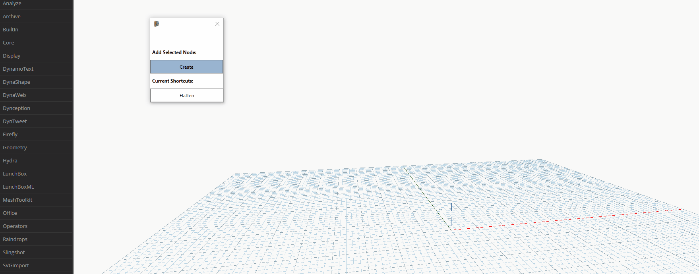

## DISCLAIMER- This is the source code of a project in its early stages. This is in no way a finished product. In order to use, you will absolutely need to know what you are doing in visual studio and be prepared for a bumpy ride.

# Sample Keyboard Shortcut View Extension for Dynamo 2.0.x

This sample is messy to say the least. But since seeing [other's](https://github.com/wynged/DynaFire) work on keyboard shortcuts with Dynamo, I though it would be neat to have buttons. Well, it turns out [Mark Thorley](https://github.com/MarkThorley/designtechViewExtension) is doing the same thing, so here is my code in its messy unrefined state.

## At This Point this Code Will
1. Read a custom KeyboardShortcuts file from roaming appdata. (not sure what it does if it is missing)
2. Automatically add buttons based on that file.
3. Allow you to add more buttons via a Dynamo node selected in the canvas (works about 50% of the time)

### Well, where is the issues page???? Like I said, at this time I have no plans of developing this further because of the great progress Mark is making on his own solution.

KTHXBYE
